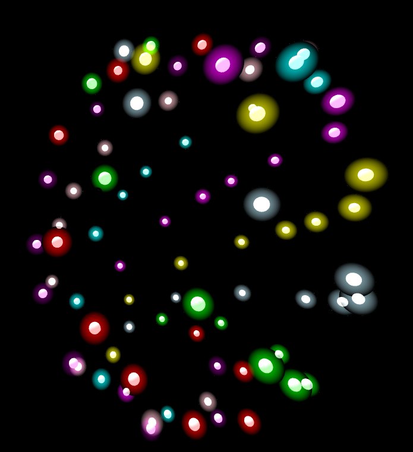

## lights in the night

I wanted to learn A-frame and as soon as I found out about the aframe-glow component I knew I wanted to use it.

_From this angle you can see the spirals traced by parametric equations-- all the lights of the same color are part of the same spiral_

# Usage

Visit the Glitch url `[https://lights-in-the-night.glitch.me/](https://lights-in-the-night.glitch.me/)` on desktop, mobile or VR device! Once you enter the scene, look at the big blue button that says "click me!" and click it. Then you can look around (click + drag), and when you get a glowing light to the center of your screen you can click it to make it glow even bigger :)

A quick heads-up:

* Contains a lot of glowing (but not flashing lights)

* Staying in VR mode for long periods of time may cause nausea

# Devices

I've tested this on desktop and Google Chrome on Android phone (including Chrome's VR mode on mobile). Unfortunately iOS seems to have some more bugs in the VR space and I haven't gotten the chance to try getting it to work there.

# Development

Run `python3 -m http.server` from the root of the folder and open localhost:8000 in a browser.

# Known issues

* Page may take a while to load, but it should be pretty smooth sailing once it's ready. This most likely has to do with Three.js and how I'm setting up the scene right now.

* The glow shader works differently on desktop vs. mobile, so what looks great on the computer is nearly invisible on the phone! I was able to reproduce this problem with the shader demo at https://stemkoski.github.io/Three.js/Shader-Glow.html, so it's not a bug with the code here. As a temporary work around, I've set it up so that if you're viewing it on mobile, the glowing mesh gets lit from the back and you can still see the colors.

* When in VR mode on the phone, clicks don't seem to register (although they do on desktop and non-VR mode on the phone). Unfortunately, this means that you don't get to click the lights in VR mode at the moment. TODO: check this link out- https://www.chromestatus.com/feature/6048666307526656#details. Might be able to work around this by detecting the tap using an overlay that detects touch events and then have it relay the information to A-frame. More info: https://github.com/aframevr/aframe/issues/4372#issuecomment-569121003

* A general mountain of TODOs, hacks, and hardcoded things (but hey, the demo works, right?)

* The shader doesn't seem to work on Windows in Chrome-- it appears to be a similar problem with Android without reversed glow meshes, where the mesh is nearly invisible for some unknown reason

# Why does your index.html have so many copy-pasted elements?

I suspected there might've been some sort of issue with appending elements so I decided to avoid programmatically adding them in case that was the issue. In retrospect, it probably wasn't, but I haven't bothered with changing it back because my main goal here was to get a demo working as fast as possible and I had other priorities.

# Acknowledgements

* https://github.com/etiennepinchon/aframe-glow for the glow.js code

* https://stemkoski.github.io/Three.js/Shader-Glow.html inspiration for the aframe-glow component and a convenient way to test things.

* Thanks to everyone who helped answer questions and all the documentation that made so many mysterious issues make sense!
